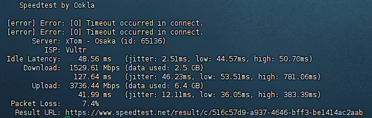

# These are some servers with special features.

------

## United States San Jose:

> Not support IPv6 in , support IPv6 out.
>
> Netflix: only netflix original drama (US) , unlock with WARP.
>
> Speedtest:
>
> | Hostname         | 107-172-234-42-host.colocrossing.com   |
> | ---------------- | -------------------------------------- |
> | ISP              | HIFormance                             |
> | IP Organization  | HIFormance                             |
> | ASN              | [AS36352](https://ip.sb/whois/AS36352) |
> | ASN Organization | AS-COLOCROSSING                        |

Domain:

```
us.867678.xyz
```

Domain(Cloudflare CDN):

```
us2.867678.xyz
```

IPv4:

```
107.172.234.42
```

------

## Seoul , South Korea:

> Supported IPv6.
>
> Netflix:  All unlock (KR) , unlock with WARP.
>
> Speedtest:
>
> | Hostname         | 	158-247-249-116.constant.com    |
> | ---------------- | ---------------------------------------- |
> | ISP              | 	Vultr                              |
> | IP Organization  | 	Vultr                             |
> | ASN              | [AS20473](https://ip.sb/whois/AS20473) |
> | ASN Organization | 	AS-CHOOPA                         |

Domain:

```
kr.867678.xyz
```

Domain(Cloudflare CDN):

```
kr2.867678.xyz
```

IPv4:

```
158.247.249.116
```

IPv6:

```
2401:c080:1c00:21f9:5400:05ff:fe19:32c6
```
------

# What can them do?

### Cloudflare proxy IP

> In port 80 and 443 and 2052 and 2082 and 8080
>
> them proxied Cloudflare domain. 
>
> So if you Cloudflare connect speed is bad 
>
> you can get height speed in this servers.


### Proxy IP(SNI IP)

> If you use cloudflare workers build vless proxy
>
> You will need proxy IP , Without them, you won't be able to open your Cloudflare website.
>
> You can fill in the server domain name, just like "const proxyIPs = ["us.867678.xyz"];"


# Cloudflare free services.

## Speedtest URL :

> Cloudflare R2 
>
> File size : 300MB(286MiB(300,000,000Bytes))
>
> Sha256: e8671610daa5dc152578d9bfe8e25346aa73fa600f908b235f55bf51d0eb5a05 

```
https://s.867678.xyz/speedtest
```

------


# More servers is buliding.

# The author does not assume any responsibility.

# We don't collect any logs , If you worry we collect it , You can Self make a server(Code at "Depoly codes" Floder).

# IP info from IP.SB.
