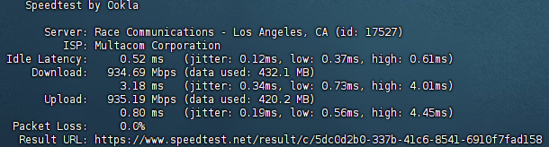

# These are some servers with special features.
# What can them do?

### Cloudflare proxy IP

> On these servers, ports 80, 443, 2052, 2082, and 8080 are reverse proxied to Cloudflare CDN. If your Cloudflare speed is very slow, you can try to configure IP force pointing to get high speed from these servers.


### Proxy IP(SNI IP)

> If you using cloudflare workers build vless proxy
>
> You will need proxy IP , Without them, you won't be able to open your Cloudflare website.
>
> You can fill in the server domain name, just like "const proxyIPs = ["us.867678.xyz"];"

## Los Angeles , California , USA :

> No IPV6 support.
>
> Netflix: Unlocks original series and can't be used in full (region is the US)
>
> Speed test:
>
> [Download file from this server.](http://us.867678.xyz:81)
>
> [Download file from this server with ssl.](https://us.867678.xyz:82)
>
> 
>
> | Hostname         | None                     |
> | ---------------- | ---------------------------------------- |
> | ISP              | 	Multacom Corporation                         |
> | IP Organization  | 	Multacom Corporation                         |
> | ASN              | [AS35916](https://ip.sb/whois/AS35916) |
> | ASN Organization | 	MULTA-ASN1                         |


```
us.867678.xyz
```

Domain(Cloudflare CDN):

```
us2.867678.xyz
```

IPv4:

```
74.48.125.113
```

IPv6(only outbouth):

```
2a09:bac5:636b:1846::26b:7
```

------

## Tokyo , Kyoto , Japan :

> Full IPV6 support.
>
> Netflix: Unlocks non-original series and can be used in full (region is the Japan)
>
> Speed test:
>
> [Download file from this server.](http://jp.867678.xyz:81)
>
> [Download file from this server with ssl.](https://jp.867678.xyz:82)
>
> 
>
> | Hostname         | None                     |
> | ---------------- | ---------------------------------------- |
> | ISP              | 	G-Core Labs SA                         |
> | IP Organization  | 	G-Core Labs SA                         |
> | ASN              | [AS199524](https://ip.sb/whois/AS199524) |
> | ASN Organization | 	G-Core Labs SA                         |


```
de.867678.xyz
```

Domain(Cloudflare CDN):

```
de2.867678.xyz
```

IPv4:

```
95.85.94.165
```

IPv6:

```
2a03:90c0:112:1::4af
```

------

# Cloudflare free services.


## Cloudflare Best Domain:

>
>To use, you only need to configure a forced point
>
>For example, force the IP address of 867678.xyz to be changed to the IP address of cf.867678.xyz
>

```
cf.867678.xyz
```

## Speed test URL :

> Cloudflare R2 
>
> File size : 300MB(286MiB(300,000,000Bytes))
>
> Sha256: e8671610daa5dc152578d9bfe8e25346aa73fa600f908b235f55bf51d0eb5a05 

```
https://s.867678.xyz/speedtest
```

------


# More servers is building.

# The author does not assume any responsibility.

# We don't collect any logs , If you worry we collect it , You can Self make a server(Code at "Deploy codes" Floder).

# IP info from IP.SB.
