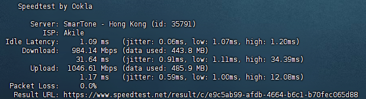

# These are some servers with special features.

------

## United States San Jose:

> Does not support IPV6 inbound, supports IPV6 outbound (use warp to take over IPV6)
>
> Netflix: Unlocks non-original series and can be used in full (region is the United States)
>
> Speed test:
>
> [Download file from this server.](http://us.867678.xyz:81)
>
> [Download file from this server with ssl.](https://us.867678.xyz:82)
>
> 
>
> | Hostname         | 107-172-234-42-host.colocrossing.com   |
> | ---------------- | -------------------------------------- |
> | ISP              | HIFormance                             |
> | IP Organization  | HIFormance                             |
> | ASN              | [AS36352](https://ip.sb/whois/AS36352) |
> | ASN Organization | AS-COLOCROSSING                        |

Domain:

```
us.867678.xyz
```

Domain(Cloudflare CDN):

```
us2.867678.xyz
```

IPv4:

```
107.172.234.42
```

------

## Hongkong , Hongkong:

> Full IPV6 support.
>
> Netflix: Unlocks non-original series and can be used in full (region is the Hongkong)
>
> Speed test:
>
> [Download file from this server.](http://hk.867678.xyz:81)
>
> [Download file from this server with ssl.](https://hk.867678.xyz:82)
>
> 
>
> | Hostname         | 		None    |
> | ---------------- | ---------------------------------------- |
> | ISP              | 	Akile                              |
> | IP Organization  | 	Akile                             |
> | ASN              | [AS61112](https://ip.sb/whois/AS61112) |
> | ASN Organization | 		AKILE LTD                         |

Domain:

```
hk.867678.xyz
```

Domain(Cloudflare CDN):

```
hk2.867678.xyz
```

IPv4:

```
141.11.148.62
```

IPv6:

```
2401:b60:5:0:fde6:329f:2983:1092
```
------
## Tokyo , Japan :

> Full IPV6 support.
>
> Netflix: Unlocks non-original series and can be used in full (region is the Germany)
>
> Speed test:
>
> [Download file from this server.](http://jp.867678.xyz:81)
>
> [Download file from this server with ssl.](https://jp.867678.xyz:82)
>
> 
>
> | Hostname         | hc-dxez-01.evoxt.com                     |
> | ---------------- | ---------------------------------------- |
> | ISP              | Evoxt Enterprise                         |
> | IP Organization  | Evoxt Enterprise                         |
> | ASN              | [AS149440](https://ip.sb/whois/AS149440) |
> | ASN Organization | Evoxt Enterprise                         |


```
jp.867678.xyz
```

Domain(Cloudflare CDN):

```
jp2.867678.xyz
```

IPv4:

```
23.27.201.17
```

IPv6:

```
2400:8d60:10::fe21:286f
```

------


# What can them do?

### Cloudflare proxy IP

> On these servers, ports 80, 443, 2052, 2082, and 8080 are reverse proxied to Cloudflare CDN. If your Cloudflare speed is very slow, you can try to configure IP force pointing to get high speed from these servers.


### Proxy IP(SNI IP)

> If you using cloudflare workers build vless proxy
>
> You will need proxy IP , Without them, you won't be able to open your Cloudflare website.
>
> You can fill in the server domain name, just like "const proxyIPs = ["us.867678.xyz"];"


# Cloudflare free services.


## Cloudflare Best Domain:

>
>To use, you only need to configure a forced point
>
>For example, force the IP address of 867678.xyz to be changed to the IP address of cf.867678.xyz
>

```
cf.867678.xyz
```

## Speed test URL :

> Cloudflare R2 
>
> File size : 300MB(286MiB(300,000,000Bytes))
>
> Sha256: e8671610daa5dc152578d9bfe8e25346aa73fa600f908b235f55bf51d0eb5a05 

```
https://s.867678.xyz/speedtest
```

------


# More servers is building.

# The author does not assume any responsibility.

# We don't collect any logs , If you worry we collect it , You can Self make a server(Code at "Deploy codes" Floder).

# IP info from IP.SB.
