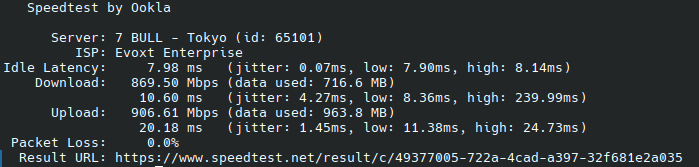

# These are some servers with special features.
# What can them do?

### Cloudflare proxy IP

> On these servers, ports 80, 443, 2052, 2082, and 8080 are reverse proxied to Cloudflare CDN. If your Cloudflare speed is very slow, you can try to configure IP force pointing to get high speed from these servers.
### Speedtest
#### Iperf3

> These servers has iperf3 service , you can using :
```
iperf3 -c [IP/Domain] -R -L 4
```
to speedtest your download speed

>OR using :
```
iperf3 -c [IP/Domain] -L 4
```
to speedtest your upload speed

#### HTTP Download

> Cleck [Download file from this server with ssl.] to using http download a 300MiB file.
>
> (Ago it support unssl but now not support it , Because now most services are all using ssl.)

### Proxy IP(SNI IP)

> If you using cloudflare workers build vless proxy
>
> You will need proxy IP , Without them, you won't be able to open your Cloudflare website.
>
> You can fill in the server domain name, just like "const proxyIPs = ["us.867678.xyz"];"

### Free Proxy Server

>Using socks5://[server IP/Domain]:9527 to using free socks5 proxy , but not support UDP
>
>Uh... Please you save me monies , I've for love to made them.

## Los Angeles , California , USA (LAX) :

> Full IPV6 support.
>
> Netflix: Unlocks original series and can be used in full (region is the US)
>
> Speed test:
>
> [Download file from this server with ssl.](https://us.867678.xyz:81)
>
> 
>

>ISP info(from ipinfo.io and its ipv4 addr):
```
{
  "ip": "74.48.125.113",
  "city": "Los Angeles",
  "region": "California",
  "country": "US",
  "loc": "34.0522,-118.2437",
  "org": "AS35916 MULTACOM CORPORATION",
  "postal": "90009",
  "timezone": "America/Los_Angeles",
  "readme": "https://ipinfo.io/missingauth"
}
```

>Server info:
```
{
  "provider": "cloudcone",
  "core": "2",
  "threads": "2",
  "ram": "1G",
  "bandwidth": "1Gbps",
  "price": "USD$12.99/yr",
  "region": "lax",
  "maturity": "2025-12-26",
  "os": "ubuntuserver 24.04 lts"
}
```


Domain:
```
us.867678.xyz
```
Domain with CloudflareCDN:
```
us2.867678.xyz
```


IPv4:

```
74.48.125.113
```

IPv6:

```
2607:f130:0000:0153:0000:0000:ae12:43b5
```
```
2607:f130:0000:0153:0000:0000:d7fa:9ca5
```
```
2607:f130:0000:0153:0000:0000:f239:9af0
```

------

## Osaka , Japan :

> Full IPV6 support.
>
> Netflix: Unlocks non-original series and can be used in full (region is the Japan)
>
> Speed test:
>
> [Download file from this server with ssl.](https://jp.867678.xyz:81)
>
> 
>


>ISP info(from ipinfo.io and its ipv4 addr):
```
{
  "ip": "166.88.100.243",
  "city": "Osaka",
  "region": "Osaka",
  "country": "JP",
  "loc": "34.6962,135.4945",
  "org": "AS149440 Evoxt Enterprise",
  "postal": "530-0003",
  "timezone": "Asia/Tokyo",
  "readme": "https://ipinfo.io/missingauth"
}
```


>Server info:
```
{
  "provider": "evoxt",
  "core": "1",
  "threads": "1",
  "ram": "0.5G",
  "bandwidth": "1Gbps",
  "price": "USD$3.60/mo",
  "region": "osa",
  "maturity": "2025-08-25",
  "os": "ubuntuserver 24.04 lts"
}
```

Domain:
```
jp.867678.xyz
```
Domain with CloudflareCDN:
```
jp2.867678.xyz
```

IPv4:

```
166.88.100.243
```

IPv6:

```
2400:8d60:8:0000:0000:0000:0c0b:1ea8
```

------


# Cloudflare free services.

## Speedtest URL :

> Cloudflare R2
>
> 
>
> File size : 300MB(286MiB(300,000,000Bytes))
>
> Sha256: e8671610daa5dc152578d9bfe8e25346aa73fa600f908b235f55bf51d0eb5a05 

```
https://s.867678.xyz/speedtest
```

------


# More servers is building.

# The author does not assume any responsibility.

# We don't collect any logs , If you worry we collect it , You can Self make a server(Code at "Deploy codes" Floder).

# IP info from IP.SB.
