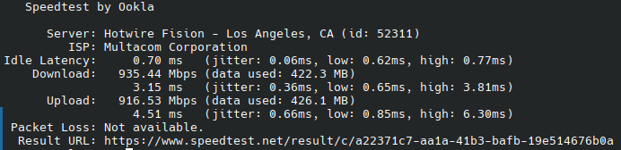

# These are some servers with special features.
# What can them do?

### Cloudflare proxy IP

> On these servers, ports 80, 443, 2052, 2082, and 8080 are reverse proxied to Cloudflare CDN. If your Cloudflare speed is very slow, you can try to configure IP force pointing to get high speed from these servers.
### Speedtest
#### Iperf3

> These servers has iperf3 service , you can using :
```
iperf3 -c [IP/Domain] -R -L 4
```
to speedtest your download speed

OR using :
```
iperf3 -c [IP/Domain]
```
to speedtest your upload speed

#### HTTP Download

> Cleck [Download file from this server.] or [Download file from this server with ssl.] to using http download a 300MiB file.

### Proxy IP(SNI IP)

> If you using cloudflare workers build vless proxy
>
> You will need proxy IP , Without them, you won't be able to open your Cloudflare website.
>
> You can fill in the server domain name, just like "const proxyIPs = ["us.867678.xyz"];"

### Free Proxy Server

>Using socks5://[server IP/Domain] to using free socks5 proxy , but not support UDP
>
>Uh... Please you save me monies , I've for love to made them.

## Los Angeles , California , USA :

> Full IPV6 support.
>
> Netflix: Unlocks original series and can't be used in full (region is the US)
>
> Speed test:
>
> [Download file from this server.](http://us.867678.xyz:81)
>
> [Download file from this server with ssl.](https://us.867678.xyz:82)
>
> 
>
> | Hostname         | us.867678.xyz                            |
> | ---------------- | ---------------------------------------- |
> | ISP              | 	Multacom Corporation                    |
> | IP Organization  | 	Multacom Corporation                    |
> | ASN              | [AS35916](https://ip.sb/whois/AS35916)   |
> | ASN Organization | 	MULTA-ASN1                              |


Domain of the IPV4:
```
us.867678.xyz
```
Domain of the IPV4 with CloudflareCDN:
```
us2.867678.xyz
```


IPv4:

```
74.48.125.113
```

IPv6(All the three IPs):

```
2607:f130:0000:0153:0000:0000:ae12:43b5
```
```
2607:f130:0000:0153:0000:0000:d7fa:9ca5
```
```
2607:f130:0000:0153:0000:0000:f239:9af0
```

------

## Osaka , Japan :

> Full IPV6 support.
>
> Netflix: Unlocks non-original series and can be used in full (region is the Japan)
>
> Speed test:
>
> [Download file from this server.](http://jp.867678.xyz:81)
>
> [Download file from this server with ssl.](https://jp.867678.xyz:82)
>
> 
>
> | Hostname         | am-vsxg-01.evoxt.com                     |
> | ---------------- | ---------------------------------------- |
> | ISP              | Evoxt Enterprise                         |
> | IP Organization  | Evoxt Enterprise                         |
> | ASN              | [AS149440](https://ip.sb/whois/AS149440) |
> | ASN Organization | Evoxt Enterprise                         |


Domain of the IPV4:
```
jp.867678.xyz
```
Domain of the IPV4 with CloudflareCDN:
```
jp2.867678.xyz
```

IPv4:

```
166.88.100.243
```

IPv6:

```
2400:8d60:8:0000:0000:0000:0c0b:1ea8
```

------


# Cloudflare free services.

## Speed test URL :

> Cloudflare R2 
>
> File size : 300MB(286MiB(300,000,000Bytes))
>
> Sha256: e8671610daa5dc152578d9bfe8e25346aa73fa600f908b235f55bf51d0eb5a05 

```
https://s.867678.xyz/speedtest
```

------


# More servers is building.

# The author does not assume any responsibility.

# We don't collect any logs , If you worry we collect it , You can Self make a server(Code at "Deploy codes" Floder).

# IP info from IP.SB.
